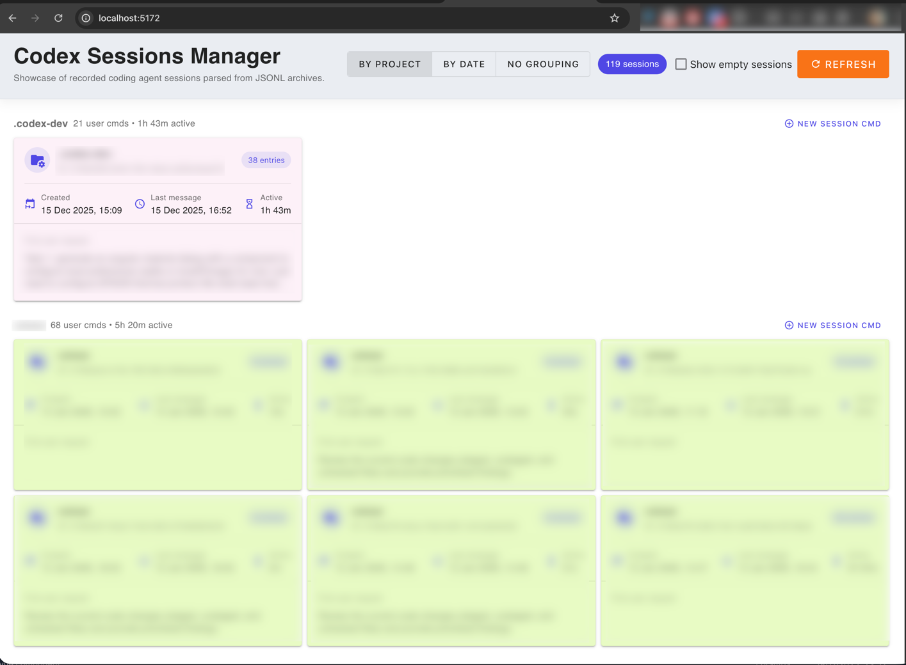
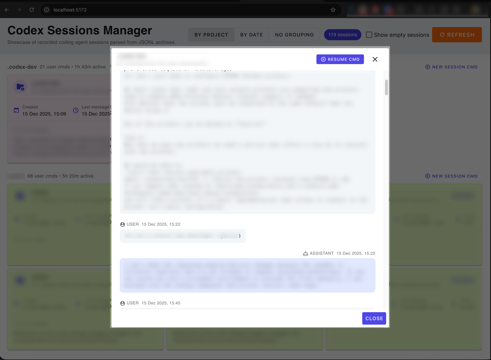

<p align="center">
  
  
  
  
  
  
</p>

# Codex Sessions Manager

Codex Sessions Manager is a local running SPA interface that simplifies working with session archives created by the Codex coding agent.  
By default, Codex allows you to resume a previous session only if you manually saved its session ID.  
If the ID was lost, you have to browse through the `.codex/sessions` folder and inspect files one by one to find the right session.

This application solves that problem by providing a clean, convenient UI for browsing, searching, and managing Codex sessions directly in your browser.

### Key Features
- 📂 **Browse all local Codex sessions**  
  Automatically discovers and displays session files stored by Codex.
- ⚡ **Copy a ready-to-use command to resume any session**  
  One click gives you the exact command to jump into the correct project directory and continue the session using its ID.
- 📝 **View the full conversation history within each session**  
  No need to open or parse raw JSON files manually.
- 🧹 **Filter or delete empty and unwanted sessions**
- 🗂 **Group sessions by date or by project**
- 📊 **View detailed statistics**, including:
    - number of commands issued per session
    - time spent inside a session
    - project-level totals
    - and more

The app runs entirely on your local machine and never sends any data anywhere.

## Installation instructions 
This section covers deploying on a Windows machine that uses WSL2 for Codex, with Node running inside a Docker container and sessions stored in WSL.


### Prerequisites
- Windows 10/11 with WSL2 installed and a Linux distribution set up.
- Docker Desktop for Windows with WSL backend enabled.
- pnpm installed in the Docker container (or use `corepack enable`).
- Codex installed and runnable directly inside WSL.

### Session Storage Layout
- Codex writes sessions to `/home/<user>/.codex/sessions/` inside WSL.
- The app expects a `sessions/` folder in its working directory.
- You must mount the WSL sessions directory into the container at `/var/www/codex-sessions-manager/sessions`.

### Environment Configuration
- Copy `.env.example` to `.env` if present (or create `.env`) and set:
  - `SESSIONS_ROOT_PATH=/home/<user>/.codex/sessions`
  - `VITE_HOST=0.0.0.0` (default binding for dev/preview)
  - `VITE_PORT=5172` (default port; change if needed to avoid conflicts)
- Never hardcode absolute Windows paths in code; use the env var above.

### Running in Docker (Node in container, Codex in WSL)
1) **Open the project in WSL:**  
   ```bash
   cd /var/www/codex-sessions-manager
   ```
2) **Build the image (once):**  
   ```bash
   docker build -t codex-sessions-manager .
   ```
3) **Run the container with volume mapping:**  
   Replace `<user>` with your WSL username.
   ```bash
   docker run --rm -it \
     -p 5172:5172 \
     -v /home/<user>/.codex/sessions:/var/www/codex-sessions-manager/sessions \
     codex-sessions-manager \
     pnpm run dev -- --host "$VITE_HOST" --port "$VITE_PORT"
   ```
   - The `-v` flag makes live session files from Codex available to the app.
   - The `--host` flag binds to all interfaces so the browser can reach Vite.
   - Adjust `-p 5172:5172` if you change `VITE_PORT`.
4) **Open the app:**  
   In Windows, browse to `http://localhost:5172`.

### Running in Docker (Unix [MacOS - Linux])

```
# nav to project
cd to/this/project

# build image `codex-sessions`
docker build -t codex-sessions .

# start container from `codex-sessions` image
# codex sessions are stored in `~/.codex/sessions`
docker run --name codex-sessions --rm -p 5172:5172 -e VITE_HOST=0.0.0.0 -e VITE_PORT=5172 -v ~/.codex/sessions:/app/sessions codex-sessions

```


### Using Codex with the app
- Run Codex directly in WSL (`codex ...`) so it writes to `/home/<user>/.codex/sessions/`.
- Click **Refresh** in the app header to pull new sessions without restarting the dev server.

### Production Build (optional)
If you need a production bundle inside the container:
```bash
docker run --rm -it \
  -v /home/<user>/.codex/sessions:/var/www/codex-sessions-manager/sessions \
  codex-sessions-manager \
  pnpm run build
```
Serve the `dist/` directory with your preferred static server (e.g., `pnpm run preview -- --host "$VITE_HOST" --port "$VITE_PORT"`).

### Troubleshooting
- **No sessions visible:** Confirm the volume mount path and `SESSIONS_ROOT_PATH` match `/home/<user>/.codex/sessions`. Ensure Codex has created session files.
- **Port conflicts:** Change the `-p` mapping and `--port` flag consistently.
- **Permissions issues:** Verify your WSL user owns the session directory; use `chmod -R` or `chown` inside WSL if needed.

### App Preview
#### Session List


#### Session Discussion

